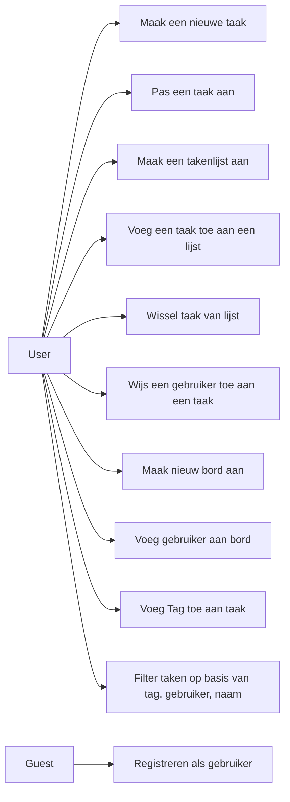
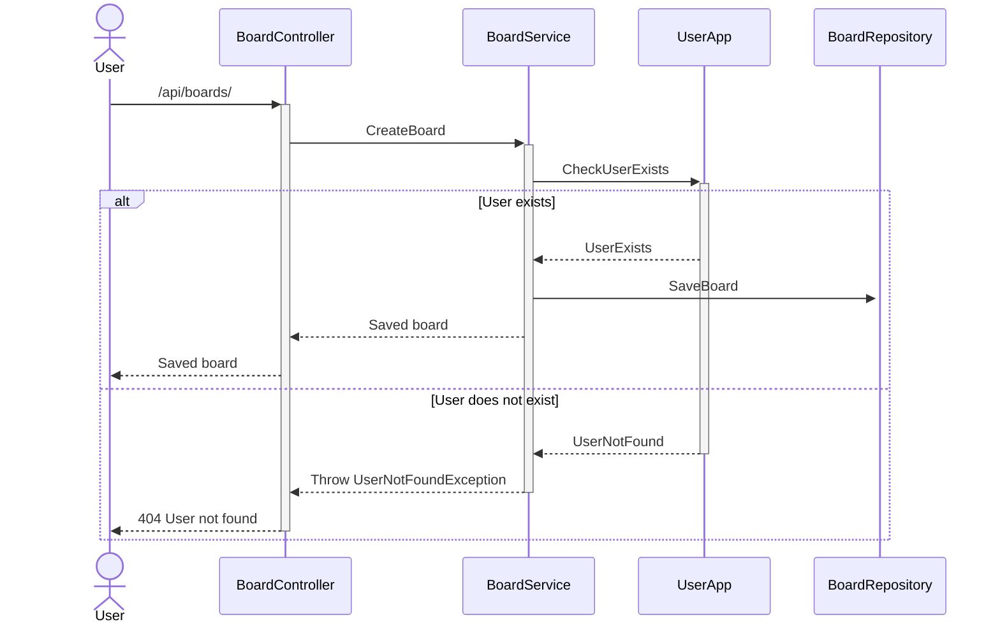
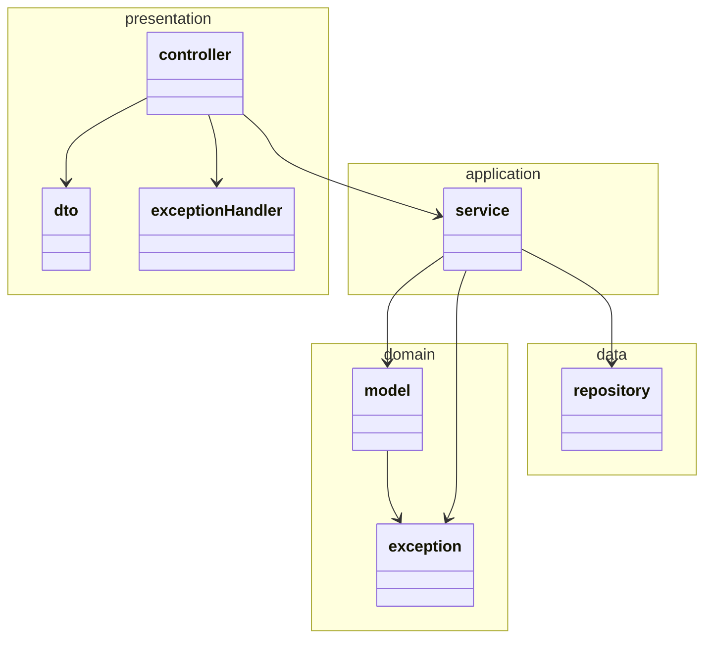

# CNSD Eindopdracht module 1

- Jarno Wieman
- Jochem Nieuwenhuizen

## Frontend

The frontend is available at this bucket:  
http://jochem-task-management-website.s3-website-us-east-1.amazonaws.com/

## Backend

The backend is available with this alb endpoint:  
http://ecs-task-managment-cluster-alb-1803841971.us-east-1.elb.amazonaws.com

## CI/CD Pipelines

## SonarQube

[[Board](https://sonar.cloud-native-minor.it/dashboard?id=wiemanboy-CNSDEindopdrachtModule1-board)  
[  
[  
Note: The frontend doesn't quite work with sonarqube.
The coverage is not taken correctly, and SonarQube doesn't have native support for the `.svelte` format.

## Setup

The project includes a global docker that sets up the entire project.
The docker-compose file is located in the root of the project.

### Frontend

The frontend requires the PUBLIC_API_BASE_URL environment variable to be set to the base url of the backend (in system
environment or .env file, see env.example).
Keep in mind that the backends are running on different ports, so locally you will have to switch between the two.
(This can be fixed by setting up a reverse proxy or something, but it's 20:00 on a friday so...)

### Backend

The backend also requires some environment variables to be set.
I would recommend
looking at the docker-compose file to see the environment variables needed to configure your local environment.

### CI/CD

The Test pipeline runs on every pr to `master` or `release/**` branch.
The Release pipeline runs on every push to `master` or `release/**` branch.
The Deploy pipeline runs on every release.

The following secrets are needed to run the pipelines:

- AWS_ACCESS_KEY_ID
- AWS_SECRET_ACCESS_KEY
- AWS_SESSION_TOKEN
- DEPLOYMENT_DB_HOST
- DEPLOYMENT_DB_PASSWORD
- DEPLOYMENT_DB_PORT
- DEPLOYMENT_DB_USERNAME
- SONAR_QUBE_BOARD_TOKEN
- SONAR_QUBE_FRONTEND_TOKEN
- SONAR_QUBE_URL
- SONAR_QUBE_USER_TOKEN
- TOKEN (Github token)

The following variables are needed to run the pipelines:

- API_BASE_URL = http://ecs-task-managment-cluster-alb-1803841971.us-east-1.elb.amazonaws.com
- AWS_ECR_URI = 084661144670.dkr.ecr.us-east-1.amazonaws.com
- CORS_ALLOWED_ORIGINS = http://jochem-task-management-website.s3-website-us-east-1.amazonaws.com/
- DEPLOY_BUCKET = jochem-task-management-website
- SONAR_QUBE_BOARD_PROJECT_KEY = wiemanboy-CNSDEindopdrachtModule1-board
- SONAR_QUBE_FRONTEND_PROJECT_KEY = wiemanboy-CNSDEindopdrachtModule1-frontend
- SONAR_QUBE_USER_PROJECT_KEY = wiemanboy-CNSDEindopdrachtModule1-user

### Deployment

All AWS resources should be active and running (all services with one task).
If not, the database should be activated and in the services the desired tasks should be updated.

For a more detailed explanation see the Deployment diagram.

## Readme's voor de verschillende onderdelen

* [User](https://github.com/wiemanboy/CNSDEindopdrachtModule1/blob/master/user/README.md)
* [Board](https://github.com/wiemanboy/CNSDEindopdrachtModule1/blob/master/board/README.md)
* [Frontend](https://github.com/wiemanboy/CNSDEindopdrachtModule1/blob/master/frontend/README.md)

## Tabel van requirements

| **Categorie**                                                                                 | **Eisen**                                                                                                                                                                               | **Prioriteit** | **Status** |
|-----------------------------------------------------------------------------------------------|-----------------------------------------------------------------------------------------------------------------------------------------------------------------------------------------|----------------|------------|
| **Functionele eisen (20%)**                                                                   | Applicatie functioneert als integraal geheel! Frontend i.c.m. backend                                                                                                                   | MUST           | ✔️         |
|                                                                                               | Als gebruiker wil ik taken aanmaken met een naam en beschrijving, zodat ik overzicht kan creëren in mijn taken                                                                          | MUST           | ✔️         |
|                                                                                               | Als gebruiker wil ik lijsten (kolommen) maken en taken daarin plaatsen, zodat ik overzicht heb van de status of categorisering van de taken                                             | MUST           | ✔️         |
|                                                                                               | Als gebruiker wil ik taken kunnen wisselen van lijst, zodat ik voortgang of werkzaamheden inzichtelijk heb                                                                              | MUST           | ✔️         |
|                                                                                               | Als gebruiker wil ik taken kunnen aanpassen, zodat ik informatie kan toevoegen of aanpassen                                                                                             | MUST           | ✔️         |
|                                                                                               | Als nieuwe gebruiker wil ik mij kunnen registreren, zodat ik kan samenwerken (UserId doorgeven is voldoende)                                                                            | MUST           | ✔️         |
|                                                                                               | Als gebruiker wil ik andere gebruikers toekennen aan taken, zodat het duidelijk is wie aan welke taak werkt (service moet controleren dat gebruiker bestaat)                            | MUST           | ✔️         |
|                                                                                               | Als gebruiker wil ik meerdere borden met taken kunnen aanmaken, zodat ik verschillende werkgroepen uit elkaar kan houden                                                                | SHOULD         | ✔️         |
|                                                                                               | Als gebruiker wil ik andere gebruikers rechten kunnen geven op een bord, zodat ik kan samenwerken met hen (service moet controleren dat gebruiker bestaat en rechten heeft op het bord) | COULD          | ❌          |
|                                                                                               | Als gebruiker wil ik tags kunnen toekennen aan taken en van taken kunnen verwijderen                                                                                                    | COULD          | ✔️         |
|                                                                                               | Als gebruiker wil ik taken filteren, zodat ik inzicht kan krijgen in mijn taken (filteren op tag, gebruiker, naam)                                                                      | COULD          | ❌          |
| **Ontwerpen en ontwikkelen van microservice applicaties voor de Amazon Cloud (10%)**          | Consistente en leesbare code                                                                                                                                                            | MUST           | ✔️         |
|                                                                                               | Applicatie wordt opgeleverd met beschrijving hoe te starten                                                                                                                             | MUST           | ❌          |
|                                                                                               | Spring Boot correct toegepast                                                                                                                                                           | MUST           | ✔️         |
|                                                                                               | Drie lagen architectuur toegepast                                                                                                                                                       | MUST           | 🆗         |
|                                                                                               | REST principes op de juiste manier toegepast                                                                                                                                            | MUST           | ✔️         |
|                                                                                               | API ontwerp en documentatie (Swagger/OpenAPI)                                                                                                                                           | COULD          | ✔️         |
|                                                                                               | AOP toegepast                                                                                                                                                                           | COULD          | ❌          |
| **Ontwerpen en ontwikkelen van front-end applicaties deployed in de Amazon Cloud (10%)**      | Consistente en leesbare code                                                                                                                                                            | MUST           | ✔️         |
|                                                                                               | Applicatie wordt opgeleverd met beschrijving hoe te starten                                                                                                                             | MUST           | ✔️         |
|                                                                                               | S3 toegepast                                                                                                                                                                            | MUST           | ✔️         |
|                                                                                               | CORS correct toegepast                                                                                                                                                                  | MUST           | ✔️         |
|                                                                                               | Angular of ander gangbaar framework correct toegepast                                                                                                                                   | SHOULD         | ✔️         |
|                                                                                               | Goede User Experience                                                                                                                                                                   | COULD          | 🆗         |
|                                                                                               | Statestore (NgRx/Redux) correct toegepast                                                                                                                                               | COULD          | ✔️         |
| **Ontwerpen en ontwikkelen van applicaties met SQL-databases (5%)**                           | JPA correct toegepast                                                                                                                                                                   | MUST           | ✔️         |
|                                                                                               | PostgresSQL (RDS) toegepast (Iedere service zijn eigen database binnen de RDBMS)                                                                                                        | MUST           | ✔️         |
|                                                                                               | Transactions correct toegepast                                                                                                                                                          | COULD          | ✔️         |
|                                                                                               | Database ontwerp (ER-diagram)                                                                                                                                                           | COULD          | ❌          |
| **Toepassen van Container technologie voor de deployment van microservice applicaties (10%)** | Backend gedeployed in containers                                                                                                                                                        | MUST           | ✔️         |
|                                                                                               | Correct gebruik gemaakt van container registry                                                                                                                                          | SHOULD         | ✔️         |
|                                                                                               | Gedeployed in ECS/Fargate                                                                                                                                                               | COULD          | ✔️         |
|                                                                                               | Development setup in Docker Compose                                                                                                                                                     | COULD          | ✔️         |
| **Toepassen van Continuous Integration, -Delivery en -Deployment (15%)**                      | Source code beschikbaar in private GitHub repository (mono repo)                                                                                                                        | MUST           | ✔️         |
|                                                                                               | CI in release pipeline voor de backend en frontend (bouwt de software, runt unit- en integratie tests, levert getagde build)                                                            | MUST           | ✔️         |
|                                                                                               | CD in release pipeline voor de backend ingericht en werkend (deployment in staging omgeving)                                                                                            | SHOULD         | ✔️         |
|                                                                                               | CD in release pipeline voor de frontend ingericht en werkend (deployment in staging omgeving)                                                                                           | SHOULD         | ✔️         |
|                                                                                               | QA via SonarQube in pipelines (backend en eventueel frontend)                                                                                                                           | SHOULD         | ✔️         |
|                                                                                               | Functionele testen in release pipelines opgenomen                                                                                                                                       | COULD          | ❌          |
|                                                                                               | Productie omgeving ingericht, werkend en automatisch gedeployed                                                                                                                         | COULD          | ✔️         |
|                                                                                               | Feature pipelines ingericht (backend en eventueel frontend)                                                                                                                             | COULD          | ✔️         |
| **Geautomatiseerd testen van applicaties (15%)**                                              | Unittesten voor de backend                                                                                                                                                              | MUST           | ✔️         |
|                                                                                               | Integratietesten voor de backend (@SpringBootTest + TestRestTemplate + MockServer)                                                                                                      | MUST           | ✔️         |
|                                                                                               | Unittesten voor de frontend                                                                                                                                                             | SHOULD         | ✔️         |
|                                                                                               | Functionele testen voor de backend (Cucumber scenario testen op REST-niveau over de services heen)                                                                                      | COULD          | ✔️         |
|                                                                                               | Playwright (Cypress) testen voor de frontend                                                                                                                                            | COULD          | ❌          |
|                                                                                               | SonarQube Quality Gate is passed (e.g. Codecoverage >80%)                                                                                                                               | COULD          | ✔️         |
|                                                                                               | Mutation testing toegepast                                                                                                                                                              | COULD          | ✔️         |
| **Kennis van cloud- en container architecturen (10%)**                                        | Logische opdeling in microservices gemaakt (minimaal 2 services)                                                                                                                        | MUST           | ✔️         |
|                                                                                               | Logical view beschreven (Domein model en context)                                                                                                                                       | MUST           | ✔️         |
|                                                                                               | Development view beschreven (component- en package diagrammen of C4)                                                                                                                    | MUST           | ✔️         |
|                                                                                               | Deployment view met AWS cloud deployment diagram beschreven                                                                                                                             | MUST           | ✔️         |
|                                                                                               | AWS en benodigde services correct toegepast                                                                                                                                             | MUST           | ✔️         |
|                                                                                               | Scenario view beschreven (use-case diagram)                                                                                                                                             | SHOULD         | ✔️         |
|                                                                                               | Process view beschreven (system sequence diagram)                                                                                                                                       | SHOULD         | ❌          |
|                                                                                               | Andere diagrammen toegevoegd om ontwerp te verduidelijken                                                                                                                               | COULD          | ✔️         |
| **Kennis van cloud infrastructuur en kosten (5%)**                                            | README.MD in de git repo beschrijft het project en bevat verwijzingen naar alle relevante onderdelen                                                                                    | MUST           | ✔️         |
|                                                                                               | Security Groups correct toegepast (met least privilege principle)                                                                                                                       | SHOULD         | ✔️         |
|                                                                                               | Kosten zijn beheerst en niet uit budget gelopen                                                                                                                                         | SHOULD         | ✔️         |

## Diagrams

### Use case diagram (Logical view)

Use cases for the task management system.

### System sequence diagram (Process view)

Sequence diagram for creating a board from the board service.

## Layer architecture (Development view)

We are using a 4-layer architecture.

### Domain model (Development view)

The domain model for the task management system.

### Context diagram (Development view)

The context diagram for the task management system.

### Container diagram (Development view)

Container diagram for the task management system.

### Component diagram (Development view)

#### Board (Development view)

Component diagram for the board service.

#### User (Development view)

Component diagram for the user service.

### Deployment diagram (Physical view)

Deployment diagram for the task management system in AWS.

